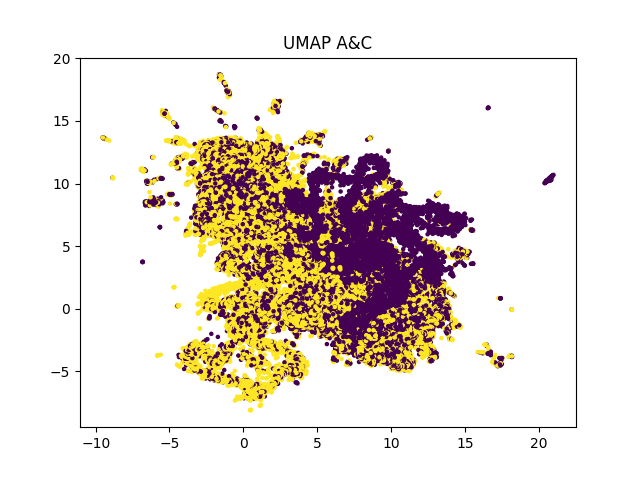

# Task 2 - Supervised & Unsupervised Clustering

**Liav Ariel (212830871)**

**Nehorai Josef (322774852)**

In Exercise 1 we received:

2 sets of TF-IDF matrices one for words and the other for die, each set with 3 matrices, A, B and C

2 sets of matrices of W2V one for words and the other for die, each set with 3 matrices, A, B and C

A set of one doc2vec matrix of the source files, this group has 3 matrices, A, B and C

A set of one BERT or UV matrix of the source files, this group has 3 matrices, A, B, and C

A total of 18 matrices.

In this exercise for all three matrices A, B and C in each of the groups you will form three pairs: (1) A and B, (2) A
and C, (3) B and C, I will use different classifiers to form clusters.

At first, I used unsupervised learning (K-means, DBSCAN, Mixture of Gaussian) and then supervised learning (ANN, Naive
Bayes, Logistic Regression).

This report will discuss how we work and the results.

# How I used the data of matrices:

I retrieved all groups of matrices to data structure of list of lists:

vectors_A = [v1, v2, ..., v500]

vectors_B = [v1, v2, ..., v500]

vectors_C = [v1, v2, ..., v500]

and then I create list of tuples, every tuple is a pair:

pairs = [(vectors_A, vectors_B), (vectors_A, vectors_C), (vectors_B, vectors_C)]

For each pair in pairs, I label group of pair[0] as 0, and group of pair[1] as 1.

I did a consolidation operation into one numpy list for runtime efficiency.

And I create another numpy array of labels, first 5000 values are 0 and the other are 1.

I use this for all the next classifiers.

# Unsupervised Classifiers:

# K-means

**Liav Ariel was Assigned to this task.**

K-means get only the numpy array of vectors with n_clusters parameter of 2 and do his operation.

The result will list of labels, every index will represent the label that K-means choose for the vector in the same
index.

Then I use the truth labels and the predicted labels for evaluate the results.

I can't know which label the classifier chose for each group, so I'm trying to evaluate the 2 options:

1. pair[0] as label 0 and pair[1] as label 1.
2. pair[0] as label 1 and pair[1] as label 0.

> **K-means on Bert On Source matrices**

**Results**

**For A & B groups:**

| option | precision           | recall | f1                 | accuracy |
|--------|---------------------|--------|--------------------|----------|
| 1      | 0.5006177415369409  | 0.4052 | 0.4478832762241627 | 0.5005   |
| 2      | 0.49938225846305906 | 0.4042 | 0.4467779374378247 | 0.4995   |

**Visualization using t-SNE:**

**For A & C groups:**

| option | precision          | recall | f1                 | accuracy |
|--------|--------------------|--------|--------------------|----------|
| 1      | 0.4840092317837125 | 0.5872 | 0.5306343755647932 | 0.4806   |
| 2      | 0.5159907682162875 | 0.626  | 0.5656967287185976 | 0.5194   |

**Visualization using t-SNE:**

**For B & C groups:**

| option | precision           | recall | f1                 | accuracy |
|--------|---------------------|--------|--------------------|----------|
| 1      | 0.48721227621483376 | 0.6096 | 0.5415778251599147 | 0.484    |
| 2      | 0.5127877237851662  | 0.6416 | 0.57000710732054   | 0.516    |

**Visualization using t-SNE:**

> **K-means on D2V On Source matrices**

**Results**

**For A & B groups:**

| option | precision           | recall | f1                 | accuracy |
|--------|---------------------|--------|--------------------|----------|
| 1      | 0.49503311258278143 | 0.8372 | 0.6221759809750297 | 0.4916   |
| 2      | 0.5049668874172185  | 0.854  | 0.6346611177170035 | 0.5084   |

**Visualization using t-SNE:**

**For A & C groups:**

| option | precision              | recall | f1                    | accuracy |
|--------|------------------------|--------|-----------------------|----------|
| 1      | 0.00020470829068577277 | 0.0002 | 0.0002023267577137076 | 0.0117   |
| 2      | 0.9997952917093142     | 0.9768 | 0.9881638846737482    | 0.9883   |

**Visualization using t-SNE:**

**For B & C groups:**

| option | precision | recall | f1                | accuracy |
|--------|-----------|--------|-------------------|----------|
| 1      | 0.0       | 0.0    | 0.0               | 0.006    |
| 2      | 1.0       | 0.988  | 0.993963782696177 | 0.994    |

**Visualization using t-SNE:**

> **K-means on TFIDF On Lemmas matrices**

**Results**

**For A & B groups:**

| option | precision          | recall | f1                 | accuracy |
|--------|--------------------|--------|--------------------|----------|
| 1      | 0.5144862795149968 | 0.8062 | 0.628126217374367  | 0.5227   |
| 2      | 0.4855137204850032 | 0.7608 | 0.5927541877678224 | 0.4773   |

**Visualization using t-SNE:**

**For A & C groups:**

| option | precision          | recall | f1                 | accuracy |
|--------|--------------------|--------|--------------------|----------|
| 1      | 0.4651939655172414 | 0.8634 | 0.6046218487394959 | 0.4354   |
| 2      | 0.5348060344827587 | 0.9926 | 0.6950980392156864 | 0.5646   |

**Visualization using t-SNE:**

**For B & C groups:**

| option | precision          | recall | f1                 | accuracy |
|--------|--------------------|--------|--------------------|----------|
| 1      | 0.4946181445412609 | 0.579  | 0.5334930433981387 | 0.4937   |
| 2      | 0.5053818554587391 | 0.5916 | 0.5451027365705335 | 0.5063   |

**Visualization using t-SNE:**

> **K-means on TFIDF On Words matrices**

**Results**

**For A & B groups:**

| option | precision          | recall | f1                 | accuracy |
|--------|--------------------|--------|--------------------|----------|
| 1      | 0.5189276405610028 | 0.8362 | 0.6404227617369993 | 0.5305   |
| 2      | 0.4810723594389971 | 0.7752 | 0.5937045263077277 | 0.4695   |

**Visualization using t-SNE:**

**For A & C groups:**

| option | precision          | recall | f1                 | accuracy |
|--------|--------------------|--------|--------------------|----------|
| 1      | 0.4671399376142842 | 0.8686 | 0.6075400433657411 | 0.4389   |
| 2      | 0.5328600623857158 | 0.9908 | 0.6930125201091138 | 0.5611   |

**Visualization using t-SNE:**

**For B & C groups:**

| option | precision         | recall | f1                 | accuracy |
|--------|-------------------|--------|--------------------|----------|
| 1      | 0.470443085505847 | 0.877  | 0.6123874031143077 | 0.4449   |
| 2      | 0.529556914494153 | 0.9872 | 0.689337336778158  | 0.5551   |

**Visualization using t-SNE:**

> **K-means on W2V On Lemmas matrices**

**Results**

**For A & B groups:**

| option | precision           | recall | f1                  | accuracy |
|--------|---------------------|--------|---------------------|----------|
| 1      | 0.5449826989619377  | 0.315  | 0.39923954372623577 | 0.526    |
| 2      | 0.45501730103806226 | 0.263  | 0.33333333333333337 | 0.474    |

**Visualization using t-SNE:**

**For A & C groups:**

| option | precision          | recall | f1                 | accuracy |
|--------|--------------------|--------|--------------------|----------|
| 1      | 0.4774651734498771 | 0.6992 | 0.5674403505924362 | 0.467    |
| 2      | 0.522534826550123  | 0.7652 | 0.6210030839149489 | 0.533    |

**Visualization using t-SNE:**

**For B & C groups:**

| option | precision           | recall | f1                 | accuracy |
|--------|---------------------|--------|--------------------|----------|
| 1      | 0.49730700179533216 | 0.7202 | 0.5883506249489421 | 0.4961   |
| 2      | 0.5026929982046678  | 0.728  | 0.594722653377992  | 0.5039   |

**Visualization using t-SNE:**

> **K-means on W2V On Words matrices**

**Results**

**For A & B groups:**

| option | precision          | recall | f1                 | accuracy |
|--------|--------------------|--------|--------------------|----------|
| 1      | 0.4704706039194774 | 0.7058 | 0.5645948324134069 | 0.4557   |
| 2      | 0.5295293960805226 | 0.7944 | 0.6354691624670026 | 0.5443   |

**Visualization using t-SNE:**

**For A & C groups:**

| option | precision           | recall | f1                 | accuracy |
|--------|---------------------|--------|--------------------|----------|
| 1      | 0.47891730141458105 | 0.7042 | 0.570110103626943  | 0.469    |
| 2      | 0.5210826985854189  | 0.7662 | 0.6203044041450777 | 0.531    |

**Visualization using t-SNE:**

**For B & C groups:**

| option | precision          | recall | f1                 | accuracy |
|--------|--------------------|--------|--------------------|----------|
| 1      | 0.5041132838840189 | 0.7476 | 0.6021747885622231 | 0.5061   |
| 2      | 0.4958867161159811 | 0.7354 | 0.5923479661699558 | 0.4939   |

**Visualization using t-SNE:**

# DBSCAN

**Liav Ariel was Assigned to this task.**

DBSCAN also get only the numpy array of vectors with epsilon & min_samples parameters.

The result will list of labels, every index will represent the label that DBSCAN chose for the vector in the same
index.

Then I use the truth labels and the predicted labels for evaluate the results.

I can't know which label the classifier chose for each group, so I'm trying to evaluate the 2 options:

1. pair[0] as label 0 and pair[1] as label 1.
2. pair[0] as label 1 and pair[1] as label 0.

**Before going on the results, I will explain how I set the epsilon parameter:**

For any pair in any type of matrices (Bert, D2V, TFIDF On Lemmas, TFIDF On Words, W2V On Lemmas, W2V On Words):

I plot a graph f(x) of K-Distance as a function of number of points.

**Let see the results for any groups:**

> **Epsilon parameter for on Bert On Source matrices**

We can see that there is a knee on K-distance of 8.

So I set:

**Bert epsilon = 8.**

> **Epsilon parameter for on D2V On Source matrices**

Let's add to the plot the graph for D2V On Source matrices:

We can see that the graphs are under Bert matrices and there is a knee on K-distance of 5.

So I set:

**D2V epsilon = 5.**

> **Epsilon parameter for on TFIDF**

**TFIDF On Lemmas matrices**

Let's add to the plot the graph for TFIDF On Lemmas matrices:

**TFIDF On Words matrices**

Let's add to the plot the graph for TFIDF On Words matrices:

We can see that the graphs of the both groups are above the previous ones and there is a knee on K-distance of 30.

So I set:

**TFIDF epsilon = 30.**

> **Epsilon parameter for on W2V**

**W2V On Lemmas matrices**

Let's add to the plot the graph for W2V On Lemmas matrices:

**W2V On Words matrices**

Let's add to the plot the graph for W2V On Words matrices:

We can see that the graphs of the both groups are extremely above the previous ones and there is a knee on K-distance of 450.

So I set:

**W2V epsilon = 450.**

I saved the parameters in: "./input/dbscan-eps.json":

{
	"Bert_eps": 8,
	"D2V_eps": 5,
	"TFIDF_eps": 30,
	"W2V_eps": 450
}

**Let see the results of DBSCAN Clustering:**

> **DBSCAN on Bert On Source matrices**

**Results**

**For A & B groups:**

| option | precision           | recall  | f1                   | accuracy |
|--------|---------------------|---------|----------------------|----------|
| 1      | 0.45096190116937007 | 0.4782  | 0.46418171228887595  | 0.448    |
| 2      | 0.5490380988306299  | 0.5822  | 0.5651329838866239   | 0.552    |

**Visualization using UMAP:**

**For A & C groups:**

| option | precision           | recall  | f1                  | accuracy |
|--------|---------------------|---------|---------------------|----------|
| 1      | 0.44331867711718603 | 0.4638  | 0.4533281204183365  | 0.4407   |
| 2      | 0.556681322882814   | 0.5824  | 0.5692503176620076  | 0.5593   |

**Visualization using UMAP:**

**For B & C groups:**

| option | precision           | recall  | f1                   | accuracy |
|--------|---------------------|---------|----------------------|----------|
| 1      | 0.4926704907584449  | 0.4638  | 0.47779952611517457  | 0.4931   |
| 2      | 0.5073295092415552  | 0.4776  | 0.4920160708766869   | 0.5069   |

**Visualization using UMAP:**

> **DBSCAN on D2V On Source matrices**

**Results**

**For A & B groups:**

| option | precision           | recall  | f1                   | accuracy |
|--------|---------------------|---------|----------------------|----------|
| 1      | 0.49182561307901906 | 0.4332  | 0.4606550404083368   | 0.4928   |
| 2      | 0.5081743869209809  | 0.4476  | 0.47596767333049766  | 0.5072   |

**Visualization using UMAP:**

**For A & C groups:**

| option | precision           | recall  | f1                   | accuracy |
|--------|---------------------|---------|----------------------|----------|
| 1      | 0.0108837614279495  | 0.005   | 0.006852131012744964 | 0.2753   |
| 2      | 0.9891162385720506  | 0.4544  | 0.6227216664382623   | 0.7247   |

**Visualization using UMAP:**

**For B & C groups:**

| option | precision             | recall  | f1                  | accuracy |
|--------|-----------------------|---------|---------------------|----------|
| 1      | 0.011373976342129208  | 0.005   | 0.00694637399277577 | 0.2852   |
| 2      | 0.9886260236578708    | 0.4346  | 0.60377882745207    | 0.7148   |

**Visualization using UMAP:**

> **DBSCAN on TFIDF On Lemmas matrices**

**Results**

**For A & B groups:**

| option | precision          | recall | f1                  | accuracy |
|--------|--------------------|--------|---------------------|----------|
| 1      | 0.463229218311023  | 0.5606 | 0.5072844086508009  | 0.4555   |
| 2      | 0.5367707816889771 | 0.6496 | 0.5878201067776672  | 0.5445   |

**Visualization using UMAP:**

**For A & C groups:**

| option | precision           | recall | f1                  | accuracy |
|--------|---------------------|--------|---------------------|----------|
| 1      | 0.4412523653879236  | 0.513  | 0.4744289281420513  | 0.4317   |
| 2      | 0.5587476346120763  | 0.6496 | 0.6007583464348468  | 0.5683   |

**Visualization using UMAP:**

**For B & C groups:**

| option | precision            | recall  | f1                  | accuracy |
|--------|----------------------|---------|---------------------|----------|
| 1      | 0.47746901990236573  | 0.5086  | 0.4925430950997482  | 0.476    |
| 2      | 0.5225309800976342   | 0.5566  | 0.5390276970753437  | 0.524    |

**Visualization using UMAP:**

> **DBSCAN on TFIDF On Words matrices**

**Results**

**For A & B groups:**

| option | precision | recall | f1                  | accuracy |
|--------|-----------|--------|---------------------|----------|
| 1      | 0.5       | 1.0    | 0.6666666666666666  | 0.5      |
| 2      | 0.5       | 1.0    | 0.6666666666666666  | 0.5      |

**Visualization using UMAP:**

**For A & C groups:**

| option | precision         | recall | f1                  | accuracy |
|--------|-------------------|--------|---------------------|----------|
| 1      | 0.44359117564926  | 0.6354 | 0.5224469659595462  | 0.4192   |
| 2      | 0.55640882435074  | 0.797  | 0.6553198487090939  | 0.5808   |

**Visualization using UMAP:**

**For B & C groups:**

| option | precision           | recall  | f1                 | accuracy |
|--------|---------------------|---------|--------------------|----------|
| 1      | 0.4633790487306682  | 0.6352  | 0.5358528766661044 | 0.4498   |
| 2      | 0.5366209512693317  | 0.7356  | 0.620550025307913  | 0.5502   |

**Visualization using UMAP:**

> **DBSCAN on W2V On Lemmas matrices**

**Results**

**For A & B groups:**

| option | precision           | recall  | f1                   | accuracy |
|--------|---------------------|---------|----------------------|----------|
| 1      | 0.6491575817641229  | 0.131   | 0.218006323847562    | 0.5301   |
| 2      | 0.3508424182358771  | 0.0708  | 0.11782326510234647  | 0.4699   |

**Visualization using UMAP:**

**For A & C groups:**

| option | precision           | recall  | f1                  | accuracy |
|--------|---------------------|---------|---------------------|----------|
| 1      | 0.6699288256227758  | 0.1506  | 0.2459177008491182  | 0.5382   |
| 2      | 0.3300711743772242  | 0.0742  | 0.12116263879817114 | 0.4618   |

**Visualization using UMAP:**

**For B & C groups:**

| option | precision            | recall  | f1                   | accuracy |
|--------|----------------------|---------|----------------------|----------|
| 1      | 0.5195058517555267   | 0.1598  | 0.24441725298256348  | 0.506    |
| 2      | 0.48049414824447334  | 0.1478  | 0.22606301621290917  | 0.494    |

**Visualization using UMAP:**

> **DBSCAN on W2V On Words matrices**

**Results**

**For A & B groups:**

| option | precision            | recall | f1                   | accuracy |
|--------|----------------------|--------|----------------------|----------|
| 1      | 0.6990496304118268   | 0.1324 | 0.22263326046746257  | 0.5377   |
| 2      | 0.30095036958817317  | 0.057  | 0.09584664536741214  | 0.4623   |

**Visualization using UMAP:**

**For A & C groups:**

| option | precision            | recall  | f1                   | accuracy |
|--------|----------------------|---------|----------------------|----------|
| 1      | 0.6894679695982627   | 0.127   | 0.21449079547373753  | 0.5349   |
| 2      | 0.31053203040173727  | 0.0572  | 0.09660530315825029  | 0.4651   |

**Visualization using UMAP:**

**For B & C groups:**

| option | precision           | recall  | f1                   | accuracy |
|--------|---------------------|---------|----------------------|----------|
| 1      | 0.48353096179183136 | 0.1468  | 0.22522246087756984  | 0.495    |
| 2      | 0.5164690382081687  | 0.1568  | 0.24056459036514266  | 0.505    |

**Visualization using UMAP:**

# Mixture of Gaussian

**Liav Ariel was Assigned to this task.**

Mixture of Gaussian get only the numpy array of vectors with n_components=2 parameter of 2 and do his operation.

The result will list of labels, every index will represent the label that Mixture of Gaussian chose for the vector in the same
index.

Then I use the truth labels and the predicted labels for evaluate the results.

I can't know which label the classifier chose for each group, so I'm trying to evaluate the 2 options:

1. pair[0] as label 0 and pair[1] as label 1.
2. pair[0] as label 1 and pair[1] as label 0.

> **Mixture of Gaussian on Bert On Source matrices**

**Results**

**For A & B groups:**

| option | precision           | recall | f1                   | accuracy |
|--------|---------------------|--------|----------------------|----------|
| 1      | 0.4901343408900084  | 0.467  | 0.47828758705448593  | 0.4906   |
| 2      | 0.5098656591099916  | 0.4858 | 0.4975419909873003   | 0.5094   |

**Visualization using t-SNE:**

**For A & C groups:**

| option | precision           | recall | f1                  | accuracy |
|--------|---------------------|--------|---------------------|----------|
| 1      | 0.5139686184462304  | 0.5372 | 0.525327596323098   | 0.5146   |
| 2      | 0.4860313815537696  | 0.508  | 0.4967729317426169  | 0.4854   |

**Visualization using t-SNE:**

**For B & C groups:**

| option | precision           | recall | f1                  | accuracy |
|--------|---------------------|--------|---------------------|----------|
| 1      | 0.5057077625570776  | 0.5316 | 0.5183307332293291  | 0.506    |
| 2      | 0.4942922374429224  | 0.5196 | 0.5066302652106083  | 0.494    |

**Visualization using t-SNE:**

> **Mixture of Gaussian on D2V On Source matrices**

**Results**

**For A & B groups:**

| option | precision            | recall | f1                  | accuracy |
|--------|----------------------|--------|---------------------|----------|
| 1      | 0.45300113250283125  | 0.48   | 0.4661099242571373  | 0.4502   |
| 2      | 0.5469988674971688   | 0.5796 | 0.5628277335404933  | 0.5498   |

**Visualization using t-SNE:**

**For A & C groups:**

| option | precision             | recall | f1                  | accuracy |
|--------|-----------------------|--------|---------------------|----------|
| 1      | 0.017102417928051897  | 0.0174 | 0.01724992564687221 | 0.0087   |
| 2      | 0.9828975820719481    | 1.0    | 0.991375037176564   | 0.9913   |

**Visualization using t-SNE:**

**For B & C groups:**

| option | precision              | recall  | f1                      | accuracy |
|--------|------------------------|---------|-------------------------|----------|
| 1      | 0.9997964997964998     | 0.9826  | 0.9911236635061529      | 0.9912   |
| 2      | 0.0002035002035002035  | 0.0002  | 0.00020173492031470649  | 0.0088   |

**Visualization using t-SNE:**

> **Mixture of Gaussian on TFIDF On Lemmas matrices**

**Results**

**For A & B groups:**

| option | precision | recall  | f1                   | accuracy |
|--------|-----------|---------|----------------------|----------|
| 1      | 0.0       | 0.0     | 0.0                  | 0.4918   |
| 2      | 1.0       | 0.0164  | 0.03227075954348682  | 0.5082   |

**Visualization using t-SNE:**

**For A & C groups:**

| option | precision           | recall  | f1                 | accuracy |
|--------|---------------------|---------|--------------------|----------|
| 1      | 0.4651939655172414  | 0.8634  | 0.6046218487394959 | 0.4354   |
| 2      | 0.5348060344827587  | 0.9926  | 0.6950980392156864 | 0.5646   |

**Visualization using t-SNE:**

**For B & C groups:**

| option | precision           | recall  | f1                  | accuracy |
|--------|---------------------|---------|---------------------|----------|
| 1      | 0.4665004336513443  | 0.8606  | 0.6050337457817773  | 0.4382   |
| 2      | 0.5334995663486557  | 0.9842  | 0.6919291338582677  | 0.5618   |

**Visualization using t-SNE:**

> **Mixture of Gaussian on TFIDF On Words matrices**

**Results**

**For A & B groups:**

| option | precision | recall | f1                    | accuracy |
|--------|-----------|--------|-----------------------|----------|
| 1      | 1.0       | 0.0004 | 0.0007996801279488206 | 0.5002   |
| 2      | 0.0       | 0.0    | 0.0                   | 0.4998   |

**Visualization using t-SNE:**

**For A & C groups:**

| option | precision           | recall  | f1                  | accuracy |
|--------|---------------------|---------|---------------------|----------|
| 1      | 0.4689066666666667  | 0.8792  | 0.6116173913043478  | 0.4417   |
| 2      | 0.5310933333333333  | 0.9958  | 0.6927304347826088  | 0.5583   |

**Visualization using t-SNE:**

**For B & C groups:**

| option | precision          | recall | f1                 | accuracy |
|--------|--------------------|--------|--------------------|----------|
| 1      | 0.470443085505847  | 0.877  | 0.6123874031143077 | 0.4449   |
| 2      | 0.529556914494153  | 0.9872 | 0.689337336778158  | 0.5551   |

**Visualization using t-SNE:**

> **Mixture of Gaussian on W2V On Lemmas matrices**

**Results**

**For A & B groups:**

| option | precision           | recall  | f1                  | accuracy |
|--------|---------------------|---------|---------------------|----------|
| 1      | 0.45624158492017697 | 0.4744  | 0.46514364153348364 | 0.4545   |
| 2      | 0.543758415079823   | 0.5654  | 0.5543680753015001  | 0.5455   |

**Visualization using t-SNE:**

**For A & C groups:**

| option | precision           | recall  | f1                 | accuracy |
|--------|---------------------|---------|--------------------|----------|
| 1      | 0.5614659685863874  | 0.5362  | 0.548542199488491  | 0.5587   |
| 2      | 0.4385340314136126  | 0.4188  | 0.4284398976982097 | 0.4413   |

**Visualization using t-SNE:**

**For B & C groups:**

| option | precision          | recall  | f1                  | accuracy |
|--------|--------------------|---------|---------------------|----------|
| 1      | 0.506797583081571  | 0.5368  | 0.5213675213675214  | 0.5072   |
| 2      | 0.493202416918429  | 0.5224  | 0.5073815073815073  | 0.4928   |

**Visualization using t-SNE:**

> **Mixture of Gaussian on W2V On Words matrices**

**Results**

**For A & B groups:**

| option | precision           | recall  | f1                    | accuracy |
|--------|---------------------|---------|-----------------------|----------|
| 1      | 0.4562752258312512  | 0.4748  | 00.46535332745270996  | 0.4545   |
| 2      | 0.5437247741687488  | 0.5658  | 0.5545427815348427    | 0.5455   |

**Visualization using t-SNE:**

**For A & C groups:**

| option | precision           | recall | f1                  | accuracy |
|--------|---------------------|--------|---------------------|----------|
| 1      | 0.5614659685863874  | 0.534  | 0.5474677055566948  | 0.5586   |
| 2      | 0.4383676903660076  | 0.4168 | 0.4273118720524913  | 0.4414   |

**Visualization using t-SNE:**

**For B & C groups:**

| option | precision           | recall | f1                   | accuracy |
|--------|---------------------|--------|----------------------|----------|
| 1      | 0.49341546304163125 | 0.4646 | 0.47857437165224553  | 0.4938   |
| 2      | 0.5065845369583687  | 0.477  | 0.49134734239802225  | 0.5062   |

**Visualization using t-SNE:**

# Supervised Classifiers:

# ANN

**Liav Ariel was Assigned to this task.**

ANN get the numpy array of vectors and the list of labels suitable to any vector index.

I shuffled the both of arrays, for make the learning process randomly.

Then, I split the data into: train_vectors and test_vectors (20% I used for testing & 80% for learning).

I'm also split the 80% of learning data into: train_vectors, val_vectors (10% I used for validation & 90% for learning).

Paraemeters I used for the Neural Network:

1. EPOCHS = 15.
2. BATCH_SIZE = 128.
3. TOPOLOGY, there is two options: 
   1. [(10, relu), (10, relu), (7, relu)]
   2. [(10, gelu), (10, gelu), (7, gelu)]
   * every pair in the list represent: (layer_size, activation_func) as a Dense Layer.

The result will list of labels, every index will represent the label that ANN chose for the vector in the same
index.

Then I use the truth labels and the predicted labels for evaluate the results.

**Results**

