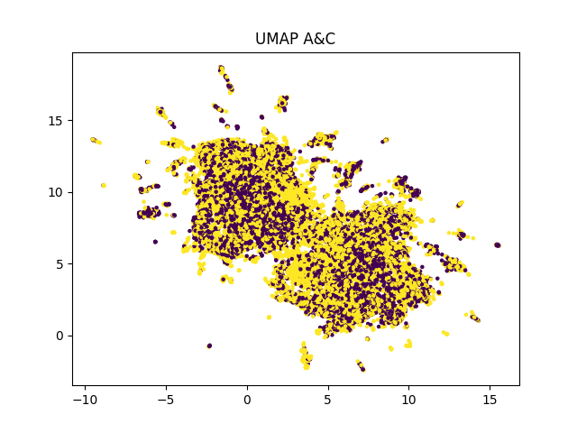
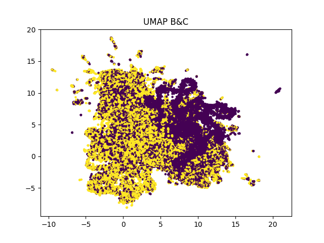

# Task 2 - Supervised & Unsupervised Clustering

**Liav Ariel (212830871)**

**Nehorai Josef (322774852)**

In Exercise 1 we received:

2 sets of TF-IDF matrices one for words and the other for die, each set with 3 matrices, A, B and C

2 sets of matrices of W2V one for words and the other for die, each set with 3 matrices, A, B and C

A set of one doc2vec matrix of the source files, this group has 3 matrices, A, B and C

A set of one BERT or UV matrix of the source files, this group has 3 matrices, A, B, and C

A total of 18 matrices.

In this exercise for all three matrices A, B and C in each of the groups you will form three pairs: (1) A and B, (2) A
and C, (3) B and C, I will use different classifiers to form clusters.

At first, I used unsupervised learning (K-means, DBSCAN, Mixture of Gaussian) and then supervised learning (ANN, Naive
Bayes, Logistic Regression).

This report will discuss how we work and the results.

# How I used the data of matrices:

I retrieved all groups of matrices to data structure of list of lists:

vectors_A = [v1, v2, ..., v500]

vectors_B = [v1, v2, ..., v500]

vectors_C = [v1, v2, ..., v500]

and then I create list of tuples, every tuple is a pair:

pairs = [(vectors_A, vectors_B), (vectors_A, vectors_C), (vectors_B, vectors_C)]

For each pair in pairs, I label group of pair[0] as 0, and group of pair[1] as 1.

I did a consolidation operation into one numpy list for runtime efficiency.

And I create another numpy array of labels, first 5000 values are 0 and the other are 1.

I use this for all the next classifiers.

# Unsupervised Classifiers:

# K-means

**Liav Ariel was Assigned to this task.**

K-means get only the numpy array of vectors with n_clusters parameter of 2 and do his operation.

The result will list of labels, every index will represent the label that K-means choose for the vector in the same
index.

Then I use the truth labels and the predicted labels for evaluate the results.

I can't know which label the classifier chose for each group, so I'm trying to evaluate the 2 options:

1. pair[0] as label 0 and pair[1] as label 1.
2. pair[0] as label 1 and pair[1] as label 0.

> **K-means on Bert On Source matrices**

**Results**

**For A & B groups:**

| option | precision           | recall | f1                 | accuracy |
|--------|---------------------|--------|--------------------|----------|
| 1      | 0.5006177415369409  | 0.4052 | 0.4478832762241627 | 0.5005   |
| 2      | 0.49938225846305906 | 0.4042 | 0.4467779374378247 | 0.4995   |

**Visualization using t-SNE:**

**For A & C groups:**

| option | precision          | recall | f1                 | accuracy |
|--------|--------------------|--------|--------------------|----------|
| 1      | 0.4840092317837125 | 0.5872 | 0.5306343755647932 | 0.4806   |
| 2      | 0.5159907682162875 | 0.626  | 0.5656967287185976 | 0.5194   |

**Visualization using t-SNE:**

**For B & C groups:**

| option | precision           | recall | f1                 | accuracy |
|--------|---------------------|--------|--------------------|----------|
| 1      | 0.48721227621483376 | 0.6096 | 0.5415778251599147 | 0.484    |
| 2      | 0.5127877237851662  | 0.6416 | 0.57000710732054   | 0.516    |

**Visualization using t-SNE:**

> **K-means on D2V On Source matrices**

**Results**

**For A & B groups:**

| option | precision           | recall | f1                 | accuracy |
|--------|---------------------|--------|--------------------|----------|
| 1      | 0.49503311258278143 | 0.8372 | 0.6221759809750297 | 0.4916   |
| 2      | 0.5049668874172185  | 0.854  | 0.6346611177170035 | 0.5084   |

**Visualization using t-SNE:**

**For A & C groups:**

| option | precision              | recall | f1                    | accuracy |
|--------|------------------------|--------|-----------------------|----------|
| 1      | 0.00020470829068577277 | 0.0002 | 0.0002023267577137076 | 0.0117   |
| 2      | 0.9997952917093142     | 0.9768 | 0.9881638846737482    | 0.9883   |

**Visualization using t-SNE:**

**For B & C groups:**

| option | precision | recall | f1                | accuracy |
|--------|-----------|--------|-------------------|----------|
| 1      | 0.0       | 0.0    | 0.0               | 0.006    |
| 2      | 1.0       | 0.988  | 0.993963782696177 | 0.994    |

**Visualization using t-SNE:**

> **K-means on TFIDF On Lemmas matrices**

**Results**

**For A & B groups:**

| option | precision          | recall | f1                 | accuracy |
|--------|--------------------|--------|--------------------|----------|
| 1      | 0.5144862795149968 | 0.8062 | 0.628126217374367  | 0.5227   |
| 2      | 0.4855137204850032 | 0.7608 | 0.5927541877678224 | 0.4773   |

**Visualization using t-SNE:**

**For A & C groups:**

| option | precision          | recall | f1                 | accuracy |
|--------|--------------------|--------|--------------------|----------|
| 1      | 0.4651939655172414 | 0.8634 | 0.6046218487394959 | 0.4354   |
| 2      | 0.5348060344827587 | 0.9926 | 0.6950980392156864 | 0.5646   |

**Visualization using t-SNE:**

**For B & C groups:**

| option | precision          | recall | f1                 | accuracy |
|--------|--------------------|--------|--------------------|----------|
| 1      | 0.4946181445412609 | 0.579  | 0.5334930433981387 | 0.4937   |
| 2      | 0.5053818554587391 | 0.5916 | 0.5451027365705335 | 0.5063   |

**Visualization using t-SNE:**

> **K-means on TFIDF On Words matrices**

**Results**

**For A & B groups:**

| option | precision          | recall | f1                 | accuracy |
|--------|--------------------|--------|--------------------|----------|
| 1      | 0.5189276405610028 | 0.8362 | 0.6404227617369993 | 0.5305   |
| 2      | 0.4810723594389971 | 0.7752 | 0.5937045263077277 | 0.4695   |

**Visualization using t-SNE:**

**For A & C groups:**

| option | precision          | recall | f1                 | accuracy |
|--------|--------------------|--------|--------------------|----------|
| 1      | 0.4671399376142842 | 0.8686 | 0.6075400433657411 | 0.4389   |
| 2      | 0.5328600623857158 | 0.9908 | 0.6930125201091138 | 0.5611   |

**Visualization using t-SNE:**

**For B & C groups:**

| option | precision         | recall | f1                 | accuracy |
|--------|-------------------|--------|--------------------|----------|
| 1      | 0.470443085505847 | 0.877  | 0.6123874031143077 | 0.4449   |
| 2      | 0.529556914494153 | 0.9872 | 0.689337336778158  | 0.5551   |

**Visualization using t-SNE:**

> **K-means on W2V On Lemmas matrices**

**Results**

**For A & B groups:**

| option | precision           | recall | f1                  | accuracy |
|--------|---------------------|--------|---------------------|----------|
| 1      | 0.5449826989619377  | 0.315  | 0.39923954372623577 | 0.526    |
| 2      | 0.45501730103806226 | 0.263  | 0.33333333333333337 | 0.474    |

**Visualization using t-SNE:**

**For A & C groups:**

| option | precision          | recall | f1                 | accuracy |
|--------|--------------------|--------|--------------------|----------|
| 1      | 0.4774651734498771 | 0.6992 | 0.5674403505924362 | 0.467    |
| 2      | 0.522534826550123  | 0.7652 | 0.6210030839149489 | 0.533    |

**Visualization using t-SNE:**

**For B & C groups:**

| option | precision           | recall | f1                 | accuracy |
|--------|---------------------|--------|--------------------|----------|
| 1      | 0.49730700179533216 | 0.7202 | 0.5883506249489421 | 0.4961   |
| 2      | 0.5026929982046678  | 0.728  | 0.594722653377992  | 0.5039   |

**Visualization using t-SNE:**

> **K-means on W2V On Words matrices**

**Results**

**For A & B groups:**

| option | precision          | recall | f1                 | accuracy |
|--------|--------------------|--------|--------------------|----------|
| 1      | 0.4704706039194774 | 0.7058 | 0.5645948324134069 | 0.4557   |
| 2      | 0.5295293960805226 | 0.7944 | 0.6354691624670026 | 0.5443   |

**Visualization using t-SNE:**

**For A & C groups:**

| option | precision           | recall | f1                 | accuracy |
|--------|---------------------|--------|--------------------|----------|
| 1      | 0.47891730141458105 | 0.7042 | 0.570110103626943  | 0.469    |
| 2      | 0.5210826985854189  | 0.7662 | 0.6203044041450777 | 0.531    |

**Visualization using t-SNE:**

**For B & C groups:**

| option | precision          | recall | f1                 | accuracy |
|--------|--------------------|--------|--------------------|----------|
| 1      | 0.5041132838840189 | 0.7476 | 0.6021747885622231 | 0.5061   |
| 2      | 0.4958867161159811 | 0.7354 | 0.5923479661699558 | 0.4939   |

**Visualization using t-SNE:**

# DBSCAN

**Liav Ariel was Assigned to this task.**

DBSCAN also get only the numpy array of vectors with epsilon & min_samples parameters.

The result will list of labels, every index will represent the label that DBSCAN chose for the vector in the same
index.

Then I use the truth labels and the predicted labels for evaluate the results.

I can't know which label the classifier chose for each group, so I'm trying to evaluate the 2 options:

1. pair[0] as label 0 and pair[1] as label 1.
2. pair[0] as label 1 and pair[1] as label 0.

**Before going on the results, I will explain how I set the epsilon parameter:**

For any pair in any type of matrices (Bert, D2V, TFIDF On Lemmas, TFIDF On Words, W2V On Lemmas, W2V On Words):

I plot a graph f(x) of K-Distance as a function of number of points.

**Let see the results for any groups:**

> **Epsilon parameter for on Bert On Source matrices**

We can see that there is a knee on K-distance of 8.

So I set:

**Bert epsilon = 8.**

> **Epsilon parameter for on D2V On Source matrices**

Let's add to the plot the graph for D2V On Source matrices:

We can see that the graphs are under Bert matrices and there is a knee on K-distance of 5.

So I set:

**D2V epsilon = 5.**

> **Epsilon parameter for on TFIDF**

**TFIDF On Lemmas matrices**

Let's add to the plot the graph for TFIDF On Lemmas matrices:

**TFIDF On Words matrices**

Let's add to the plot the graph for TFIDF On Words matrices:

We can see that the graphs of the both groups are above the previous ones and there is a knee on K-distance of 30.

So I set:

**TFIDF epsilon = 30.**

> **Epsilon parameter for on W2V**

**W2V On Lemmas matrices**

Let's add to the plot the graph for W2V On Lemmas matrices:

**W2V On Words matrices**

Let's add to the plot the graph for W2V On Words matrices:

We can see that the graphs of the both groups are extremely above the previous ones and there is a knee on K-distance of 450.

So I set:

**W2V epsilon = 450.**

I saved the parameters in: "./input/dbscan-eps.json":

{
	"Bert_eps": 8,
	"D2V_eps": 5,
	"TFIDF_eps": 30,
	"W2V_eps": 450
}

**Let see the results of DBSCAN Clustering:**

> **DBSCAN on Bert On Source matrices**

**Results**

**For A & B groups:**

| option | precision           | recall  | f1                   | accuracy |
|--------|---------------------|---------|----------------------|----------|
| 1      | 0.45096190116937007 | 0.4782  | 0.46418171228887595  | 0.448    |
| 2      | 0.5490380988306299  | 0.5822  | 0.5651329838866239   | 0.552    |

**Visualization using UMAP:**

**For A & C groups:**

| option | precision           | recall  | f1                  | accuracy |
|--------|---------------------|---------|---------------------|----------|
| 1      | 0.44331867711718603 | 0.4638  | 0.4533281204183365  | 0.4407   |
| 2      | 0.556681322882814   | 0.5824  | 0.5692503176620076  | 0.5593   |

**Visualization using UMAP:**

**For B & C groups:**

| option | precision           | recall  | f1                   | accuracy |
|--------|---------------------|---------|----------------------|----------|
| 1      | 0.4926704907584449  | 0.4638  | 0.47779952611517457  | 0.4931   |
| 2      | 0.5073295092415552  | 0.4776  | 0.4920160708766869   | 0.5069   |

**Visualization using UMAP:**

> **DBSCAN on D2V On Source matrices**

**Results**

**For A & B groups:**

| option | precision           | recall  | f1                   | accuracy |
|--------|---------------------|---------|----------------------|----------|
| 1      | 0.49182561307901906 | 0.4332  | 0.4606550404083368   | 0.4928   |
| 2      | 0.5081743869209809  | 0.4476  | 0.47596767333049766  | 0.5072   |

**Visualization using UMAP:**

**For A & C groups:**

| option | precision           | recall  | f1                   | accuracy |
|--------|---------------------|---------|----------------------|----------|
| 1      | 0.0108837614279495  | 0.005   | 0.006852131012744964 | 0.2753   |
| 2      | 0.9891162385720506  | 0.4544  | 0.6227216664382623   | 0.7247   |

**Visualization using UMAP:**

**For B & C groups:**

| option | precision             | recall  | f1                  | accuracy |
|--------|-----------------------|---------|---------------------|----------|
| 1      | 0.011373976342129208  | 0.005   | 0.00694637399277577 | 0.2852   |
| 2      | 0.9886260236578708    | 0.4346  | 0.60377882745207    | 0.7148   |

**Visualization using UMAP:**

> **DBSCAN on TFIDF On Lemmas matrices**

**Results**

**For A & B groups:**

| option | precision          | recall | f1                  | accuracy |
|--------|--------------------|--------|---------------------|----------|
| 1      | 0.463229218311023  | 0.5606 | 0.5072844086508009  | 0.4555   |
| 2      | 0.5367707816889771 | 0.6496 | 0.5878201067776672  | 0.5445   |

**Visualization using UMAP:**

**For A & C groups:**

| option | precision           | recall | f1                  | accuracy |
|--------|---------------------|--------|---------------------|----------|
| 1      | 0.4412523653879236  | 0.513  | 0.4744289281420513  | 0.4317   |
| 2      | 0.5587476346120763  | 0.6496 | 0.6007583464348468  | 0.5683   |

**Visualization using UMAP:**

**For B & C groups:**

| option | precision            | recall  | f1                  | accuracy |
|--------|----------------------|---------|---------------------|----------|
| 1      | 0.47746901990236573  | 0.5086  | 0.4925430950997482  | 0.476    |
| 2      | 0.5225309800976342   | 0.5566  | 0.5390276970753437  | 0.524    |

**Visualization using UMAP:**

> **DBSCAN on TFIDF On Words matrices**

**Results**

**For A & B groups:**

| option | precision | recall | f1                  | accuracy |
|--------|-----------|--------|---------------------|----------|
| 1      | 0.5       | 1.0    | 0.6666666666666666  | 0.5      |
| 2      | 0.5       | 1.0    | 0.6666666666666666  | 0.5      |

**Visualization using UMAP:**

**For A & C groups:**

| option | precision         | recall | f1                  | accuracy |
|--------|-------------------|--------|---------------------|----------|
| 1      | 0.44359117564926  | 0.6354 | 0.5224469659595462  | 0.4192   |
| 2      | 0.55640882435074  | 0.797  | 0.6553198487090939  | 0.5808   |

**Visualization using UMAP:**

**For B & C groups:**

| option | precision           | recall  | f1                 | accuracy |
|--------|---------------------|---------|--------------------|----------|
| 1      | 0.4633790487306682  | 0.6352  | 0.5358528766661044 | 0.4498   |
| 2      | 0.5366209512693317  | 0.7356  | 0.620550025307913  | 0.5502   |

**Visualization using UMAP:**

> **DBSCAN on W2V On Lemmas matrices**

**Results**

**For A & B groups:**

| option | precision           | recall  | f1                   | accuracy |
|--------|---------------------|---------|----------------------|----------|
| 1      | 0.6491575817641229  | 0.131   | 0.218006323847562    | 0.5301   |
| 2      | 0.3508424182358771  | 0.0708  | 0.11782326510234647  | 0.4699   |

**Visualization using UMAP:**

**For A & C groups:**

| option | precision           | recall  | f1                  | accuracy |
|--------|---------------------|---------|---------------------|----------|
| 1      | 0.6699288256227758  | 0.1506  | 0.2459177008491182  | 0.5382   |
| 2      | 0.3300711743772242  | 0.0742  | 0.12116263879817114 | 0.4618   |

**Visualization using UMAP:**

**For B & C groups:**

| option | precision            | recall  | f1                   | accuracy |
|--------|----------------------|---------|----------------------|----------|
| 1      | 0.5195058517555267   | 0.1598  | 0.24441725298256348  | 0.506    |
| 2      | 0.48049414824447334  | 0.1478  | 0.22606301621290917  | 0.494    |

**Visualization using UMAP:**

> **DBSCAN on W2V On Words matrices**

**Results**

**For A & B groups:**

| option | precision            | recall | f1                   | accuracy |
|--------|----------------------|--------|----------------------|----------|
| 1      | 0.6990496304118268   | 0.1324 | 0.22263326046746257  | 0.5377   |
| 2      | 0.30095036958817317  | 0.057  | 0.09584664536741214  | 0.4623   |

**Visualization using UMAP:**

**For A & C groups:**

| option | precision            | recall  | f1                   | accuracy |
|--------|----------------------|---------|----------------------|----------|
| 1      | 0.6894679695982627   | 0.127   | 0.21449079547373753  | 0.5349   |
| 2      | 0.31053203040173727  | 0.0572  | 0.09660530315825029  | 0.4651   |

**Visualization using UMAP:**

**For B & C groups:**

| option | precision           | recall  | f1                   | accuracy |
|--------|---------------------|---------|----------------------|----------|
| 1      | 0.48353096179183136 | 0.1468  | 0.22522246087756984  | 0.495    |
| 2      | 0.5164690382081687  | 0.1568  | 0.24056459036514266  | 0.505    |

**Visualization using UMAP:**

# Mixture of Gaussian

**Liav Ariel was Assigned to this task.**

Mixture of Gaussian get only the numpy array of vectors with n_components=2 parameter of 2 and do his operation.

The result will list of labels, every index will represent the label that Mixture of Gaussian chose for the vector in the same
index.

Then I use the truth labels and the predicted labels for evaluate the results.

I can't know which label the classifier chose for each group, so I'm trying to evaluate the 2 options:

1. pair[0] as label 0 and pair[1] as label 1.
2. pair[0] as label 1 and pair[1] as label 0.

> **Mixture of Gaussian on Bert On Source matrices**

**Results**

**For A & B groups:**

| option | precision           | recall | f1                   | accuracy |
|--------|---------------------|--------|----------------------|----------|
| 1      | 0.4901343408900084  | 0.467  | 0.47828758705448593  | 0.4906   |
| 2      | 0.5098656591099916  | 0.4858 | 0.4975419909873003   | 0.5094   |

**Visualization using t-SNE:**

**For A & C groups:**

| option | precision           | recall | f1                  | accuracy |
|--------|---------------------|--------|---------------------|----------|
| 1      | 0.5139686184462304  | 0.5372 | 0.525327596323098   | 0.5146   |
| 2      | 0.4860313815537696  | 0.508  | 0.4967729317426169  | 0.4854   |

**Visualization using t-SNE:**

**For B & C groups:**

| option | precision           | recall | f1                  | accuracy |
|--------|---------------------|--------|---------------------|----------|
| 1      | 0.5057077625570776  | 0.5316 | 0.5183307332293291  | 0.506    |
| 2      | 0.4942922374429224  | 0.5196 | 0.5066302652106083  | 0.494    |

**Visualization using t-SNE:**

> **Mixture of Gaussian on D2V On Source matrices**

**Results**

**For A & B groups:**

| option | precision            | recall | f1                  | accuracy |
|--------|----------------------|--------|---------------------|----------|
| 1      | 0.45300113250283125  | 0.48   | 0.4661099242571373  | 0.4502   |
| 2      | 0.5469988674971688   | 0.5796 | 0.5628277335404933  | 0.5498   |

**Visualization using t-SNE:**

**For A & C groups:**

| option | precision             | recall | f1                  | accuracy |
|--------|-----------------------|--------|---------------------|----------|
| 1      | 0.017102417928051897  | 0.0174 | 0.01724992564687221 | 0.0087   |
| 2      | 0.9828975820719481    | 1.0    | 0.991375037176564   | 0.9913   |

**Visualization using t-SNE:**

**For B & C groups:**

| option | precision              | recall  | f1                      | accuracy |
|--------|------------------------|---------|-------------------------|----------|
| 1      | 0.9997964997964998     | 0.9826  | 0.9911236635061529      | 0.9912   |
| 2      | 0.0002035002035002035  | 0.0002  | 0.00020173492031470649  | 0.0088   |

**Visualization using t-SNE:**

> **Mixture of Gaussian on TFIDF On Lemmas matrices**

**Results**

**For A & B groups:**

| option | precision | recall  | f1                   | accuracy |
|--------|-----------|---------|----------------------|----------|
| 1      | 0.0       | 0.0     | 0.0                  | 0.4918   |
| 2      | 1.0       | 0.0164  | 0.03227075954348682  | 0.5082   |

**Visualization using t-SNE:**

**For A & C groups:**

| option | precision           | recall  | f1                 | accuracy |
|--------|---------------------|---------|--------------------|----------|
| 1      | 0.4651939655172414  | 0.8634  | 0.6046218487394959 | 0.4354   |
| 2      | 0.5348060344827587  | 0.9926  | 0.6950980392156864 | 0.5646   |

**Visualization using t-SNE:**

**For B & C groups:**

| option | precision           | recall  | f1                  | accuracy |
|--------|---------------------|---------|---------------------|----------|
| 1      | 0.4665004336513443  | 0.8606  | 0.6050337457817773  | 0.4382   |
| 2      | 0.5334995663486557  | 0.9842  | 0.6919291338582677  | 0.5618   |

**Visualization using t-SNE:**

> **Mixture of Gaussian on TFIDF On Words matrices**

**Results**

**For A & B groups:**

| option | precision | recall | f1                    | accuracy |
|--------|-----------|--------|-----------------------|----------|
| 1      | 1.0       | 0.0004 | 0.0007996801279488206 | 0.5002   |
| 2      | 0.0       | 0.0    | 0.0                   | 0.4998   |

**Visualization using t-SNE:**

**For A & C groups:**

| option | precision           | recall  | f1                  | accuracy |
|--------|---------------------|---------|---------------------|----------|
| 1      | 0.4689066666666667  | 0.8792  | 0.6116173913043478  | 0.4417   |
| 2      | 0.5310933333333333  | 0.9958  | 0.6927304347826088  | 0.5583   |

**Visualization using t-SNE:**

**For B & C groups:**

| option | precision          | recall | f1                 | accuracy |
|--------|--------------------|--------|--------------------|----------|
| 1      | 0.470443085505847  | 0.877  | 0.6123874031143077 | 0.4449   |
| 2      | 0.529556914494153  | 0.9872 | 0.689337336778158  | 0.5551   |

**Visualization using t-SNE:**

> **Mixture of Gaussian on W2V On Lemmas matrices**

**Results**

**For A & B groups:**

| option | precision           | recall  | f1                  | accuracy |
|--------|---------------------|---------|---------------------|----------|
| 1      | 0.45624158492017697 | 0.4744  | 0.46514364153348364 | 0.4545   |
| 2      | 0.543758415079823   | 0.5654  | 0.5543680753015001  | 0.5455   |

**Visualization using t-SNE:**

**For A & C groups:**

| option | precision           | recall  | f1                 | accuracy |
|--------|---------------------|---------|--------------------|----------|
| 1      | 0.5614659685863874  | 0.5362  | 0.548542199488491  | 0.5587   |
| 2      | 0.4385340314136126  | 0.4188  | 0.4284398976982097 | 0.4413   |

**Visualization using t-SNE:**

**For B & C groups:**

| option | precision          | recall  | f1                  | accuracy |
|--------|--------------------|---------|---------------------|----------|
| 1      | 0.506797583081571  | 0.5368  | 0.5213675213675214  | 0.5072   |
| 2      | 0.493202416918429  | 0.5224  | 0.5073815073815073  | 0.4928   |

**Visualization using t-SNE:**

> **Mixture of Gaussian on W2V On Words matrices**

**Results**

**For A & B groups:**

| option | precision           | recall  | f1                   | accuracy |
|--------|---------------------|---------|----------------------|----------|
| 1      | 0.4562752258312512  | 0.4748  | 0.46535332745270996  | 0.4545   |
| 2      | 0.5437247741687488  | 0.5658  | 0.5545427815348427   | 0.5455   |

**Visualization using t-SNE:**

**For A & C groups:**

| option | precision           | recall | f1                  | accuracy |
|--------|---------------------|--------|---------------------|----------|
| 1      | 0.5614659685863874  | 0.534  | 0.5474677055566948  | 0.5586   |
| 2      | 0.4383676903660076  | 0.4168 | 0.4273118720524913  | 0.4414   |

**Visualization using t-SNE:**

**For B & C groups:**

| option | precision           | recall | f1                   | accuracy |
|--------|---------------------|--------|----------------------|----------|
| 1      | 0.49341546304163125 | 0.4646 | 0.47857437165224553  | 0.4938   |
| 2      | 0.5065845369583687  | 0.477  | 0.49134734239802225  | 0.5062   |

**Visualization using t-SNE:**

# Supervised Classifiers:

# ANN

**Liav Ariel was Assigned to this task.**

ANN get the numpy array of vectors and the list of labels suitable to any vector index.

I shuffled the both of arrays, for make the learning process randomly.

Then, I split the data into: train_vectors and test_vectors (20% I used for testing & 80% for learning).

I'm also split the 80% of learning data into: train_vectors, val_vectors (10% I used for validation & 90% for learning).

**Parameters I used for the Neural Network:**

1. EPOCHS = 15.
2. BATCH_SIZE = 128.
3. TOPOLOGY, there is two options: 
   1. [(10, relu), (10, relu), (7, relu)]
   2. [(10, gelu), (10, gelu), (7, gelu)]
   * every pair in the list represent: (layer_size, activation_func) as a Dense Layer.

**Callbacks I used for the Neural Network Fit:**

1. early_stopping = EarlyStopping(monitor='val_accuracy', patience=5, restore_best_weights=True)
2. model_checkpoint = ModelCheckpoint(checkpoint_path, monitor='val_accuracy', save_best_only=True)

The result will list of labels, every index will represent the label that ANN chose for the vector in the same
index.

Then I use the truth labels and the predicted labels for evaluate the results.

**Let's see the results:**

> **ANN on Bert On Source matrices**

**For A & B groups:**

**Training History:** 

| epoch | loss               | accuracy            | val_loss           | val_accuracy       |
|-------|--------------------|---------------------|--------------------|--------------------|
| 1     | 0.7190665006637573 | 0.49888888001441956 | 0.6930495500564575 | 0.5087500214576721 |
| 2     | 0.6931625008583069 | 0.5008333325386047  | 0.6930652856826782 | 0.5087500214576721 |
| 3     | 0.6932005286216736 | 0.5008333325386047  | 0.6930904388427734 | 0.5087500214576721 |
| 4     | 0.6931573748588562 | 0.5008333325386047  | 0.6930985450744629 | 0.5087500214576721 |
| 5     | 0.6931662559509277 | 0.5008333325386047  | 0.6930931210517883 | 0.5087500214576721 |
| 6     | 0.6931606531143188 | 0.5008333325386047  | 0.6931202411651611 | 0.5087500214576721 |

**Best model saved in:**

* output/ANN/Bert_On_Source_Groups/best_model_A&B.h5

**Results**

| precision | recall  | f1      | accuracy            |
|-----------|---------|---------|---------------------|
| 0.4935    | 0.4748  | 0.4935  | 0.6608637428858386  |

**Visualization using UMAP:**

**For A & C groups:**

**Training History:** 

| epoch | loss               | accuracy            | val_loss           | val_accuracy        |
|-------|--------------------|---------------------|--------------------|---------------------|
| 1     | 1.0549870729446411 | 0.5001388788223267  | 0.6932081580162048 | 0.49125000834465027 |
| 2     | 0.6931719183921814 | 0.4911110997200012  | 0.6931551098823547 | 0.49125000834465027 |
| 3     | 0.6931729316711426 | 0.49000000953674316 | 0.6931430697441101 | 0.5087500214576721  |
| 4     | 0.6931540966033936 | 0.4975000023841858  | 0.6931552886962891 | 0.49125000834465027 |
| 5     | 0.6931708455085754 | 0.49361109733581543 | 0.6931399703025818 | 0.5087500214576721  |
| 6     | 0.6931506991386414 | 0.503333330154419   | 0.6931752562522888 | 0.49125000834465027 |
| 7     | 0.693179726600647  | 0.49916666746139526 | 0.6931841373443604 | 0.49125000834465027 |
| 8     | 0.6931535601615906 | 0.49944445490837097 | 0.6931304931640625 | 0.5087500214576721  |

**Best model saved in:**

* output/ANN/Bert_On_Source_Groups/best_model_A&C.h5

**Results**

| precision | recall | f1      | accuracy |
|-----------|--------|---------|----------|
| 0.4935    | 1.0    | 0.6609  | 0.4935   |

**Visualization using UMAP:**

**For B & C groups:**

**Training History:** 

| epoch | loss      | accuracy | val_loss  | val_accuracy |
|-------|-----------|----------|-----------|--------------|
| 1     | 0.6956    | 0.4953   | 0.6931    | 0.5088       |
| 2     | 0.6932    | 0.4928   | 0.6931    | 0.5088       |
| 3     | 0.6932    | 0.5008   | 0.6931    | 0.5088       |
| 4     | 0.6932    | 0.4911   | 0.6931    | 0.5088       |
| 5     | 0.6932    | 0.5008   | 0.6931    | 0.5088       |
| 6     | 0.6932    | 0.5008   | 0.6931    | 0.5088       |

**Best model saved in:**

* output/ANN/Bert_On_Source_Groups/best_model_B&C.h5

**Results**

| precision | recall | f1      | accuracy |
|-----------|--------|---------|----------|
| 0.4935    | 1.0    | 0.6609  | 0.4935   |

**Visualization using UMAP:**

> **ANN on D2V On Source matrices**

**For A & B groups:**

**Training History:** 

| epoch | loss      | accuracy | val_loss  | val_accuracy |
|-------|-----------|----------|-----------|--------------|
| 1     | 0.6587    | 0.5807   | 0.6393    | 0.6175       |
| 2     | 0.6128    | 0.6560   | 0.6239    | 0.6463       |
| 3     | 0.5945    | 0.6700   | 0.6267    | 0.6488       |
| 4     | 0.5892    | 0.6744   | 0.6137    | 0.6563       |
| 5     | 0.5816    | 0.6854   | 0.6172    | 0.6475       |
| 6     | 0.5687    | 0.6914   | 0.6443    | 0.6350       |
| 7     | 0.5658    | 0.6918   | 0.6471    | 0.6450       |
| 8     | 0.5531    | 0.7018   | 0.6388    | 0.6650       |
| 9     | 0.5501    | 0.7036   | 0.6280    | 0.6750       |
| 10    | 0.5478    | 0.7049   | 0.6566    | 0.6350       |
| 11    | 0.5510    | 0.7025   | 0.6293    | 0.6587       |
| 12    | 0.5424    | 0.7104   | 0.6262    | 0.6775       |
| 13    | 0.5341    | 0.7129   | 0.6413    | 0.6737       |
| 14    | 0.5248    | 0.7242   | 0.6329    | 0.6625       |
| 15    | 0.5256    | 0.7192   | 0.6600    | 0.6513       |

**Best model saved in:**

* output/ANN/D2V_On_Source_Groups/best_model_A&B.h5

**Results**

| precision | recall  | f1      | accuracy |
|-----------|---------|---------|----------|
| 0.6637    | 0.6819  | 0.6727  | 0.6725   |

**Visualization using UMAP:**

**For A & C groups:**

**Training History:** 

| epoch | loss       | accuracy | val_loss   | val_accuracy |
|-------|------------|----------|------------|--------------|
|   1   | 0.1137     | 0.9733   | 0.0026     | 1.0          |
|   2   | 0.0009     | 0.9999   | 0.0003     | 1.0          |
|   3   | 0.0011     | 0.9999   | 0.0070     | 0.9975       |
|   4   | 0.0017     | 0.9994   | 0.0003     | 1.0          |
|   5   | 0.0001     | 1.0      | 0.0001     | 1.0          |
|   6   | 0.0000     | 1.0      | 0.0001     | 1.0          |

**Best model saved in:**

* output/ANN/D2V_On_Source_Groups/best_model_A&C.h5

**Results**

| precision | recall | f1   | accuracy |
|-----------|--------|------|----------|
| 1.0       | 1.0    | 1.0  | 1.0      |

**Visualization using UMAP:**

**For B & C groups:**

**Training History:** 

| epoch | loss       | accuracy  | val_loss   | val_accuracy |
|-------|------------|-----------|------------|--------------|
|   1   | 0.1625     | 0.9393    | 0.0214     | 0.9987       |
|   2   | 0.0035     | 0.9994    | 0.0002     | 1.0000       |
|   3   | 0.0007     | 0.9999    | 0.0002     | 1.0000       |
|   4   | 0.0005     | 0.9999    | 0.0002     | 1.0000       |
|   5   | 0.0003     | 0.9999    | 0.0001     | 1.0000       |
|   6   | 0.0002     | 1.0000    | 0.0002     | 1.0000       |
|   7   | 0.0001     | 1.0000    | 0.0001     | 1.0000       |

**Best model saved in:**

* output/ANN/D2V_On_Source_Groups/best_model_B&C.h5

**Results**

| precision | recall | f1  | accuracy |
|-----------|--------|-----|----------|
| 1.0       | 1.0    | 1.0 | 1.0      |

**Visualization using UMAP:**

> **ANN on TFIDF On Lemmas matrices**

**For A & B groups:**

**Training History:** 

| epoch | loss   | accuracy | val_loss | val_accuracy |
|-------|--------|----------|----------|--------------|
|   1   | 0.3961 | 0.8196   | 0.3084   | 0.8687       |
|   2   | 0.1390 | 0.9408   | 0.3913   | 0.8625       |
|   3   | 0.0729 | 0.9681   | 0.4518   | 0.8675       |
|   4   | 0.0412 | 0.9832   | 0.5892   | 0.8712       |
|   5   | 0.0313 | 0.9871   | 0.6495   | 0.8575       |
|   6   | 0.0288 | 0.9883   | 0.7114   | 0.8612       |
|   7   | 0.0310 | 0.9875   | 0.8378   | 0.8600       |
|   8   | 0.0433 | 0.9842   | 0.6140   | 0.8650       |
|   9   | 0.0380 | 0.9885   | 0.6036   | 0.8725       |
|  10   | 0.0181 | 0.9942   | 0.7381   | 0.8637       |
|  11   | 0.0109 | 0.9968   | 0.7498   | 0.8650       |
|  12   | 0.0064 | 0.9981   | 0.8637   | 0.8575       |
|  13   | 0.0039 | 0.9985   | 0.9189   | 0.8562       |
|  14   | 0.0029 | 0.9987   | 0.9532   | 0.8600       |

**Best model saved in:**

* output/ANN/TFIDF_On_Lemots_Groups/best_model_A&B.h5

**Results**

| precision | recall  | f1      | accuracy |
|-----------|---------|---------|----------|
| 0.8566    | 0.8896  | 0.8728  | 0.8720   |

**Visualization using UMAP:**

**For A & C groups:**

**Training History:** 

| epoch | loss   | accuracy | val_loss | val_accuracy |
|-------|--------|----------|----------|--------------|
| 1     | 0.2868 | 0.8757   | 0.1861   | 0.9262       |
| 2     | 0.0785 | 0.9736   | 0.2169   | 0.9262       |
| 3     | 0.0290 | 0.9903   | 0.2819   | 0.9212       |
| 4     | 0.0174 | 0.9935   | 0.3528   | 0.9212       |
| 5     | 0.0124 | 0.9951   | 0.3876   | 0.9237       |
| 6     | 0.0310 | 0.9906   | 0.3890   | 0.9212       |

**Best model saved in:**

* output/ANN/TFIDF_On_Lemots_Groups/best_model_A&C.h5

**Results**

| precision | recall  | f1      | accuracy |
|-----------|---------|---------|----------|
| 0.9279    | 0.9382  | 0.9330  | 0.9335   |

**Visualization using UMAP:**

**For B & C groups:**

**Training History:** 

| epoch | loss    | accuracy | val_loss | val_accuracy |
|-------|---------|----------|----------|--------------|
| 1     | 0.3874  | 0.8153   | 0.3213   | 0.8625       |
| 2     | 0.1290  | 0.9478   | 0.3922   | 0.8662       |
| 3     | 0.0614  | 0.9761   | 0.4951   | 0.8837       |
| 4     | 0.0383  | 0.9846   | 0.5490   | 0.8812       |
| 5     | 0.0274  | 0.9908   | 0.6629   | 0.8787       |
| 6     | 0.0143  | 0.9954   | 0.8173   | 0.8812       |
| 7     | 0.0241  | 0.9915   | 0.7189   | 0.8625       |
| 8     | 0.0345  | 0.9889   | 0.7857   | 0.8587       |

**Best model saved in:**

* output/ANN/TFIDF_On_Lemots_Groups/best_model_B&C.h5

**Results**

| precision | recall  | f1      | accuracy |
|-----------|---------|---------|----------|
| 0.8728    | 0.8896  | 0.8811  | 0.8815   |

**Visualization using UMAP:**

> **ANN on TFIDF On Words matrices**

**For A & B groups:**

**Training History:** 

| epoch | loss      | accuracy | val_loss  | val_accuracy |
|-------|-----------|----------|-----------|--------------|
| 1     | 0.4645    | 0.7869   | 0.4148    | 0.79         |
| 2     | 0.2116    | 0.9075   | 0.3869    | 0.8313       |
| 3     | 0.1228    | 0.949    | 0.4017    | 0.8462       |
| 4     | 0.0724    | 0.9706   | 0.5783    | 0.8375       |
| 5     | 0.0454    | 0.9828   | 0.6729    | 0.8363       |
| 6     | 0.0257    | 0.9906   | 0.7155    | 0.8413       |
| 7     | 0.0165    | 0.9947   | 0.9099    | 0.8425       |
| 8     | 0.0183    | 0.9951   | 0.9575    | 0.835        |

**Best model saved in:**

* output/ANN/TFIDF_On_Words_Groups/best_model_A&B.h5

**Results**

| precision | recall  | f1      | accuracy |
|-----------|---------|---------|----------|
| 0.8949    | 0.8369  | 0.8649  | 0.871    |

**Visualization using UMAP:**

**For A & C groups:**

**Training History:** 

| epoch | loss     | accuracy | val_loss | val_accuracy |
|-------|----------|----------|----------|--------------|
| 1     | 0.3125   | 0.8649   | 0.2085   | 0.9125       |
| 2     | 0.0828   | 0.9682   | 0.2745   | 0.9337       |
| 3     | 0.0334   | 0.9879   | 0.2962   | 0.9337       |
| 4     | 0.0143   | 0.9956   | 0.3267   | 0.9262       |
| 5     | 0.0066   | 0.9971   | 0.3416   | 0.93         |
| 6     | 0.0046   | 0.9987   | 0.3615   | 0.9312       |
| 7     | 0.0025   | 0.9992   | 0.3794   | 0.9312       |

**Best model saved in:**

* output/ANN/TFIDF_On_Words_Groups/best_model_A&C.h5

**Results**

| precision | recall  | f1      | accuracy |
|-----------|---------|---------|----------|
| 0.9117    | 0.9412  | 0.9262  | 0.926    |

**Visualization using UMAP:**

**For B & C groups:**

**Training History:** 

| epoch | loss      | accuracy | val_loss  | val_accuracy |
|-------|-----------|----------|-----------|--------------|
| 1     | 0.4190    | 0.7822   | 0.3000    | 0.8625       |
| 2     | 0.1765    | 0.9190   | 0.3264    | 0.8750       |
| 3     | 0.0981    | 0.9535   | 0.3962    | 0.8700       |
| 4     | 0.0642    | 0.9696   | 0.5044    | 0.8650       |
| 5     | 0.0561    | 0.9737   | 0.5586    | 0.8487       |
| 6     | 0.0485    | 0.9765   | 0.5386    | 0.8675       |
| 7     | 0.0293    | 0.9867   | 0.6255    | 0.8587       |

**Best model saved in:**

* output/ANN/TFIDF_On_Words_Groups/best_model_B&C.h5

**Results**

| precision | recall  | f1      | accuracy |
|-----------|---------|---------|----------|
| 0.8503    | 0.8977  | 0.8733  | 0.8715   |

**Visualization using UMAP:**

> **ANN on W2V On Lemmas matrices**

**For A & B groups:**

**Training History:** 

| epoch | loss    | accuracy | val_loss | val_accuracy |
|-------|---------|----------|----------|--------------|
| 1     | 0.9420  | 0.4972   | 0.6931   | 0.5088       |
| 2     | 0.6932  | 0.5008   | 0.6931   | 0.5088       |
| 3     | 0.6932  | 0.5008   | 0.6931   | 0.5075       |
| 4     | 0.6932  | 0.4892   | 0.6931   | 0.5075       |
| 5     | 0.6932  | 0.5008   | 0.6931   | 0.5075       |
| 6     | 0.6932  | 0.5008   | 0.6931   | 0.5075       |

**Best model saved in:**

* output/ANN/W2V_On_Lemots_Groups/best_model_A&B.h5

**Results**

| precision | recall | f1     | accuracy |
|-----------|--------|--------|----------|
| 0.4935    | 1.0    | 0.6609 | 0.4935   |

**Visualization using UMAP:**

**For A & C groups:**

**Training History:** 

| epoch | loss     | accuracy | val_loss | val_accuracy |
|-------|----------|----------|----------|--------------|
| 1     | 5.4438   | 0.6015   | 1.3009   | 0.6975       |
| 2     | 1.0697   | 0.6751   | 1.0729   | 0.705        |
| 3     | 1.0623   | 0.6833   | 1.9417   | 0.5888       |
| 4     | 1.0808   | 0.675    | 1.4932   | 0.6612       |
| 5     | 0.8938   | 0.6932   | 1.1882   | 0.6475       |
| 6     | 0.8636   | 0.695    | 1.0498   | 0.6375       |
| 7     | 0.9069   | 0.6756   | 0.7236   | 0.7088       |
| 8     | 0.7292   | 0.7026   | 0.6601   | 0.71         |
| 9     | 0.7636   | 0.6908   | 0.8331   | 0.67         |
| 10    | 0.6361   | 0.7111   | 0.6013   | 0.7113       |
| 11    | 0.628    | 0.7035   | 0.7068   | 0.685        |
| 12    | 0.6147   | 0.7108   | 0.5675   | 0.7163       |
| 13    | 0.5923   | 0.7124   | 0.6243   | 0.6925       |
| 14    | 0.5784   | 0.7121   | 0.7222   | 0.6413       |
| 15    | 0.5866   | 0.7146   | 0.5842   | 0.7038       |

**Best model saved in:**

* output/ANN/W2V_On_Lemots_Groups/best_model_A&C.h5

**Results**

| precision | recall  | f1      | accuracy |
|-----------|---------|---------|----------|
| 0.7291    | 0.7062  | 0.7174  | 0.7255   |

**Visualization using UMAP:**

**For B & C groups:**

**Training History:** 

| epoch | loss   | accuracy | val_loss | val_accuracy |
|-------|--------|----------|----------|--------------|
| 1     | 1.5928 | 0.5053   | 0.6933   | 0.4925       |
| 2     | 0.6932 | 0.4993   | 0.6932   | 0.4925       |
| 3     | 0.6932 | 0.4993   | 0.6932   | 0.4925       |
| 4     | 0.6932 | 0.4993   | 0.6931   | 0.4925       |
| 5     | 0.6932 | 0.4963   | 0.6931   | 0.5088       |
| 6     | 0.6932 | 0.5008   | 0.6931   | 0.5088       |
| 7     | 0.6932 | 0.4889   | 0.6930   | 0.5088       |
| 8     | 0.6931 | 0.5008   | 0.6930   | 0.5088       |
| 9     | 0.6931 | 0.5008   | 0.6930   | 0.5088       |
| 10    | 0.6931 | 0.4925   | 0.6930   | 0.5088       |

**Best model saved in:**

* output/ANN/W2V_On_Lemots_Groups/best_model_B&C.h5

**Results**

| precision | recall | f1       | accuracy |
|-----------|--------|----------|----------|
| 0.4935    | 1.0    | 0.6609   | 0.4935   |

**Visualization using UMAP:**

> **ANN on W2V On Words matrices**

**For A & B groups:**

**Training History:** 

| epoch | loss               | accuracy            | val_loss           | val_accuracy       |
|-------|--------------------|---------------------|--------------------|--------------------|
| 1     | 1.4743256568908691 | 0.49916666746139526 | 0.6930579543113708 | 0.5087500214576721 |
| 2     | 0.6931592226028442 | 0.5008333325386047  | 0.6930776238441467 | 0.5087500214576721 |
| 3     | 0.6931557655334473 | 0.5008333325386047  | 0.6930813789367676 | 0.5087500214576721 |
| 4     | 0.6931514739990234 | 0.5008333325386047  | 0.6931092143058777 | 0.5087500214576721 |
| 5     | 0.6931660175323486 | 0.5008333325386047  | 0.6931145191192627 | 0.5087500214576721 |
| 6     | 0.6931784152984619 | 0.5008333325386047  | 0.6931097507476807 | 0.5087500214576721 |

**Best model saved in:**

* output/ANN/W2V_On_Words_Groups/best_model_A&B.h5

**Results**

| precision | recall | f1      | accuracy |
|-----------|--------|---------|----------|
| 0.4935    | 1.0    | 0.6609  | 0.4935   |

**Visualization using UMAP:**

**For A & C groups:**

**Training History:** 

| epoch | loss               | accuracy            | val_loss           | val_accuracy        |
|-------|--------------------|---------------------|--------------------|---------------------|
| 1     | 0.7668010592460632 | 0.4980555474758148  | 0.6931716799736023 | 0.49125000834465027 |
| 2     | 0.6931598782539368 | 0.48972222208976746 | 0.6931447386741638 | 0.5087500214576721  |
| 3     | 0.6931672096252441 | 0.4948611259460449  | 0.693145751953125  | 0.5087500214576721  |
| 4     | 0.6930901408195496 | 0.49861112236976624 | 0.6931764483451843 | 0.49125000834465027 |
| 5     | 0.6931163668632507 | 0.49916666746139526 | 0.6931633949279785 | 0.49125000834465027 |
| 6     | 0.6930755376815796 | 0.4868055582046509  | 0.6931384205818176 | 0.5087500214576721  |
| 7     | 0.6930662989616394 | 0.48875001072883606 | 0.6931235790252686 | 0.5087500214576721  |

**Best model saved in:**

* output/ANN/W2V_On_Words_Groups/best_model_A&C.h5

**Results**

| precision | recall               | f1                  | accuracy           |
|-----------|----------------------|---------------------|--------------------|
| 0.493     | 0.9989868287740629   | 0.6604152712659075  | 0.493              |

**Visualization using UMAP:**

**For B & C groups:**

**Training History:** 

| epoch | loss                | accuracy           | val_loss            | val_accuracy       |
|-------|---------------------|--------------------|---------------------|--------------------|
| 1     | 1.0835742950439453  | 0.5024999976158142 | 0.6930184960365295  | 0.5087500214576721 |
| 2     | 0.6931048035621643  | 0.5006944537162781 | 0.6929811835289001  | 0.5087500214576721 |
| 3     | 0.6930080652236938  | 0.5008333325386047 | 0.6927525997161865  | 0.5087500214576721 |
| 4     | 0.6926894783973694  | 0.5008333325386047 | 0.691321849822998   | 0.5087500214576721 |
| 5     | 0.6910025477409363  | 0.4952777922153473 | 0.6856589317321777  | 0.5087500214576721 |
| 6     | 0.689047634601593   | 0.512499988079071  | 0.6819801330566406  | 0.5149999856948853 |
| 7     | 0.6861644983291626  | 0.5161111354827881 | 0.6779662370681763  | 0.5249999761581421 |
| 8     | 0.6845610737800598  | 0.5174999833106995 | 0.6752521395683289  | 0.5299999713897705 |
| 9     | 0.684680163860321   | 0.5202777981758118 | 0.6752808094024658  | 0.5262500047683716 |
| 10    | 0.6798139810562134  | 0.5412499904632568 | 0.6744754910469055  | 0.5400000214576721 |
| 11    | 0.6774593591690063  | 0.5523611307144165 | 0.6857457756996155  | 0.5224999785423279 |
| 12    | 0.6803144216537476  | 0.550694465637207  | 0.6828837394714355  | 0.5262500047683716 |
| 13    | 0.6641634106636047  | 0.597777783870697  | 0.7025818824768066  | 0.612500011920929  |
| 14    | 0.6894028782844543  | 0.5243055820465088 | 0.6826173663139343  | 0.5162500143051147 |
| 15    | 0.6819881200790405  | 0.539305567741394  | 0.6674870848655701  | 0.5687500238418579 |

**Best model saved in:**

* output/ANN/W2V_On_Words_Groups/best_model_B&C.h5

**Results**

| precision           | recall              | f1                  | accuracy            |
|---------------------|---------------------|---------------------|---------------------|
| 0.7066246056782335  | 0.22695035460992907 | 0.34355828220858897 | 0.572               |

**Visualization using UMAP:**

# Naive Bayes

**Liav Ariel was Assigned to this task.**

Naive Bayes get the numpy array of vectors and the list of labels suitable to any vector index.

I shuffled the both of arrays, for make the learning process randomly.

Then, I split the data into: train_vectors and test_vectors (20% I used for testing & 80% for learning).

I'm also split the 80% of learning data into: train_vectors, val_vectors (10% I used for validation & 90% for learning).

The result will list of labels, every index will represent the label that Naive Bayes chose for the vector in the same
index.

Then I use the truth labels and the predicted labels for evaluate the results.

**Let's see the results:**

> **Naive Bayes on Bert On Source matrices**

**For A & B groups:**

**Results**

| precision           | recall              | f1                  | accuracy            |
|---------------------|---------------------|---------------------|---------------------|
| 0.612987012987013   | 0.23910840932117527 | 0.34402332361516036 | 0.55                |

**Visualization using UMAP:**

**For A & C groups:**

**Results**

| precision           | recall              | f1                  | accuracy            |
|---------------------|---------------------|---------------------|---------------------|
| 0.6659340659340659  | 0.3069908814589666  | 0.42024965325936203 | 0.582               |

**Visualization using UMAP:**

**For B & C groups:**

**Results**

| precision           | recall              | f1                  | accuracy            |
|---------------------|---------------------|---------------------|---------------------|
| 0.5783333333333334  | 0.3515704154002026  | 0.4373030875866415  | 0.5535              |

**Visualization using UMAP:**

> **Naive Bayes on D2V On Source matrices**

**For A & B groups:**

**Results**

| precision           | recall              | f1                  | accuracy            |
|---------------------|---------------------|---------------------|---------------------|
| 0.5847328244274809  | 0.3880445795339412  | 0.46650426309378806 | 0.562               |

**Visualization using UMAP:**

**For A & C groups:**

**Results**

| precision           | recall              | f1                  | accuracy            |
|---------------------|---------------------|---------------------|---------------------|
| 0.9546891464699684  | 0.9179331306990881  | 0.9359504132231405  | 0.938               |

**Visualization using UMAP:**

**For B & C groups:**

**Results**

| precision           | recall              | f1                  | accuracy            |
|---------------------|---------------------|---------------------|---------------------|
| 0.9606801275239107  | 0.9159067882472138  | 0.9377593360995851  | 0.94                |

**Visualization using UMAP:**

> **Naive Bayes on TFIDF On Lemmas matrices**

**For A & B groups:**

**Results**

| precision           | recall              | f1                  | accuracy            |
|---------------------|---------------------|---------------------|---------------------|
| 0.8512960436562074  | 0.6322188449848024  | 0.7255813953488373  | 0.764               |

**Visualization using UMAP:**

**For A & C groups:**

**Results**

| precision           | recall              | f1                  | accuracy            |
|---------------------|---------------------|---------------------|---------------------|
| 0.9093050647820966  | 0.7821681864235056  | 0.840958605664488   | 0.854               |

**Visualization using UMAP:**

**For B & C groups:**

**Results**

| precision           | recall              | f1                  | accuracy            |
|---------------------|---------------------|---------------------|---------------------|
| 0.7953488372093023  | 0.8662613981762918  | 0.8292919495635305  | 0.824               |

**Visualization using UMAP:**

> **Naive Bayes on TFIDF On Words matrices**

**For A & B groups:**

**Results**

| precision           | recall              | f1                  | accuracy            |
|---------------------|---------------------|---------------------|---------------------|
| 0.9037758830694276  | 0.75177304964539    | 0.8207964601769911  | 0.838               |

**Visualization using UMAP:**

**For A & C groups:**

**Results**

| precision           | recall              | f1                  | accuracy            |
|---------------------|---------------------|---------------------|---------------------|
| 0.9394594594594594  | 0.8804457953394124  | 0.9089958158995816  | 0.913               |

**Visualization using UMAP:**

**For B & C groups:**

**Results**

| precision           | recall              | f1                  | accuracy            |
|---------------------|---------------------|---------------------|---------------------|
| 0.8240302743614002  | 0.8824721377912867  | 0.8522504892367906  | 0.849               |

**Visualization using UMAP:**

> **Naive Bayes on W2V On Lemmas matrices**

**For A & B groups:**

**Results**

| precision           | recall              | f1                  | accuracy            |
|---------------------|---------------------|---------------------|---------------------|
| 0.6098654708520179  | 0.2755825734549139  | 0.3796231681786462  | 0.5555              |

**Visualization using UMAP:**

**For A & C groups:**

**Results**

| precision           | recall              | f1                  | accuracy            |
|---------------------|---------------------|---------------------|---------------------|
| 0.6510067114093959  | 0.2948328267477204  | 0.40585774058577406 | 0.574               |

**Visualization using UMAP:**

**For B & C groups:**

**Results**

| precision           | recall              | f1                  | accuracy            |
|---------------------|---------------------|---------------------|---------------------|
| 0.7138964577656676  | 0.26545086119554206 | 0.3870014771048744  | 0.585               |

**Visualization using UMAP:**

> **Naive Bayes on W2V On Words matrices**

**For A & B groups:**

**Results**

| precision           | recall              | f1                  | accuracy            |
|---------------------|---------------------|---------------------|---------------------|
| 0.625               | 0.2735562310030395  | 0.38054968287526425 | 0.5605              |

**Visualization using UMAP:**

**For A & C groups:**

**Results**

| precision           | recall              | f1                  | accuracy            |
|---------------------|---------------------|---------------------|---------------------|
| 0.6409574468085106  | 0.24417426545086118 | 0.3536316947909024  | 0.5595              |

**Visualization using UMAP:**

**For B & C groups:**

**Results**

| precision           | recall              | f1                  | accuracy            |
|---------------------|---------------------|---------------------|---------------------|
| 0.5097911227154047  | 0.7912867274569402  | 0.6200873362445416  | 0.5215              |

**Visualization using UMAP:**

.

I'm also split the 80% of learning data into: train_vectors, val_vectors (10% I used for validation & 90% for learning).

The result will list of labels, every index will represent the label that Logistic Regression chose for the vector in the same
index.

Then I use the truth labels and the predicted labels for evaluate the results.

**Let's see the results:**

> **Logistic Regression on Bert On Source matrices**

**For A & B groups:**

**Results**

| precision           | recall              | f1                  | accuracy            |
|---------------------|---------------------|---------------------|---------------------|
| 0.7136194029850746  | 0.7750759878419453  | 0.7430791646430306  | 0.7355              |

**Visualization using UMAP:**

**For A & C groups:**

**Results**

| precision           | recall              | f1                  | accuracy            |
|---------------------|---------------------|---------------------|---------------------|
| 0.8439581351094196  | 0.8986828774062816  | 0.8704612365063789  | 0.868               |

**Visualization using UMAP:**

**For B & C groups:**

**Results**

| precision           | recall              | f1                  | accuracy            |
|---------------------|---------------------|---------------------|---------------------|
| 0.775023832221163   | 0.8237082066869301  | 0.7986247544204321  | 0.795               |

**Visualization using UMAP:**

> **Logistic Regression on D2V On Source matrices**

**For A & B groups:**

**Results**

| precision           | recall              | f1                  | accuracy            |
|---------------------|---------------------|---------------------|---------------------|
| 0.6270853778213935  | 0.6474164133738601  | 0.6370887337986041  | 0.636               |

**Visualization using UMAP:**

**For A & C groups:**

**Results**

| precision           | recall              | f1                  | accuracy            |
|---------------------|---------------------|---------------------|---------------------|
| 0.9989878542510121  | 1.0                 | 0.9994936708860759  | 0.9995              |

**Visualization using UMAP:**

**For B & C groups:**

**Results**

| precision           | recall              | f1                  | accuracy            |
|---------------------|---------------------|---------------------|---------------------|
| 0.9989878542510121  | 1.0                 | 0.9994936708860759  | 0.9995              |

**Visualization using UMAP:**

> **Logistic Regression on TFIDF On Lemmas matrices**

**For A & B groups:**

**Results**

| precision           | recall              | f1                  | accuracy            |
|---------------------|---------------------|---------------------|---------------------|
| 0.8616915422885573  | 0.8774062816616008  | 0.8694779116465864  | 0.87                |

**Visualization using UMAP:**

**For A & C groups:**

**Results**

| precision           | recall              | f1                  | accuracy            |
|---------------------|---------------------|---------------------|---------------------|
| 0.9233067729083665  | 0.939209726443769   | 0.9311903566047212  | 0.9315              |

**Visualization using UMAP:**

**For B & C groups:**

**Results**

| precision           | recall              | f1                  | accuracy            |
|---------------------|---------------------|---------------------|---------------------|
| 0.8635926993275697  | 0.9108409321175278  | 0.8865877712031558  | 0.885               |

**Visualization using UMAP:**

> **Logistic Regression on TFIDF On Words matrices**

**For A & B groups:**

**Results**

| precision           | recall              | f1                  | accuracy            |
|---------------------|---------------------|---------------------|---------------------|
| 0.8481624758220503  | 0.8885511651469098  | 0.867887184562098   | 0.8665              |

**Visualization using UMAP:**

**For A & C groups:**

**Results**

| precision           | recall              | f1                  | accuracy            |
|---------------------|---------------------|---------------------|---------------------|
| 0.9225490196078432  | 0.9533941236068896  | 0.9377179870453414  | 0.9375              |

**Visualization using UMAP:**

**For B & C groups:**

**Results**

| precision           | recall              | f1                  | accuracy            |
|---------------------|---------------------|---------------------|---------------------|
| 0.8629191321499013  | 0.8865248226950354  | 0.8745627186406797  | 0.8745              |

**Visualization using UMAP:**

> **Logistic Regression on W2V On Lemmas matrices**

**For A & B groups:**

**Results**

| precision           | recall              | f1                  | accuracy            |
|---------------------|---------------------|---------------------|---------------------|
| 0.6905965621840243  | 0.6919959473150963  | 0.6912955465587045  | 0.695               |

**Visualization using UMAP:**

**For A & C groups:**

**Results**

| precision           | recall              | f1                  | accuracy            |
|---------------------|---------------------|---------------------|---------------------|
| 0.7353535353535353  | 0.7375886524822695  | 0.7364693980778957  | 0.7395              |

**Visualization using UMAP:**

**For B & C groups:**

**Results**

| precision           | recall              | f1                  | accuracy            |
|---------------------|---------------------|---------------------|---------------------|
| 0.6914175506268081  | 0.7264437689969605  | 0.7084980237154149  | 0.705               |

**Visualization using UMAP:**

> **Logistic Regression on W2V On Words matrices**

**For A & B groups:**

**Results**

| precision           | recall              | f1                  | accuracy            |
|---------------------|---------------------|---------------------|---------------------|
| 0.6821256038647343  | 0.7152988855116514  | 0.6983184965380812  | 0.695               |

**Visualization using UMAP:**

**For A & C groups:**

**Results**

| precision           | recall              | f1                  | accuracy            |
|---------------------|---------------------|---------------------|---------------------|
| 0.7094918504314478  | 0.7497467071935157  | 0.729064039408867   | 0.725               |

**Visualization using UMAP:**

**For B & C groups:**

**Results**

| precision           | recall              | f1                  | accuracy            |
|---------------------|---------------------|---------------------|---------------------|
| 0.6693914623069936  | 0.7467071935157041  | 0.7059386973180077  | 0.693               |

**Visualization using UMAP:**

